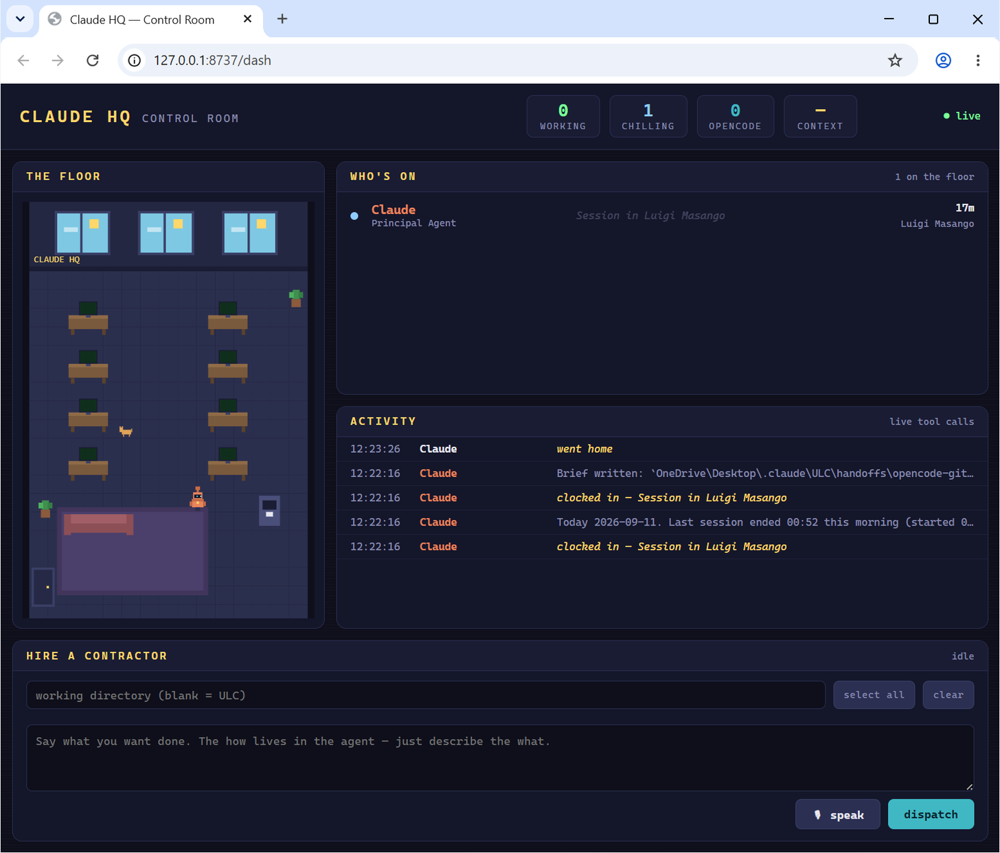

# 🏢 Claude HQ

Telegram Mini App rendering a live pixel-art office of your Claude Code and OpenCode sessions.

[](LICENSE)
[](https://github.com/luigimasango-dev/claude-office/actions/workflows/ci.yml)
[](https://nodejs.org/)



## Quick start

Requires Node 18+. **Just the dashboard in a browser** (no Telegram, no
tunnel) — tested 2026-09-11 on Windows 11:

```powershell
git clone https://github.com/luigimasango-dev/claude-office.git
cd claude-office
$env:NO_TUNNEL='1'; node server.js
```

Then open `http://localhost:8737/dash` in Chrome. The screenshot above is
that page running against real local sessions.

**Telegram Mini App:**

1. Copy `.env.example` → `.env` and paste your bot token from @BotFather.
2. `npm start`
3. Open your bot in Telegram → tap the **🏢 Claude HQ** menu button.

The quick-tunnel URL changes on every launch, but step 3 always works
because the menu button is re-pointed automatically at startup. On POSIX,
`NO_TUNNEL=1 node server.js` replaces the `set` prefix in the npm scripts.

## How it works

Every active session is a Claude at a desk; every subagent is a robot
coworker; every OpenCode run is a **contractor in a hard hat**. Agents
actively working type at a glowing monitor; recently-idle ones are
**chilling** in the lounge with coffee; after 30 minutes of silence they
walk out the door. Tap anyone to see what they're doing. There is also a
cat. The cat answers to no one.

- `server.js` (zero npm dependencies) scans two sources every 3s:
  - `~/.claude/projects/**` — session and subagent `.jsonl` transcripts
  - `~/.local/share/opencode/opencode.db` — OpenCode `session` table
    (via built-in `node:sqlite`; `OPENCODE_DB` overrides the path)
- File mtimes drive status:
  - touched < 2 min ago → **working**
  - touched < 30 min ago → **chilling**
  - older → gone home
- **Live activity.** Both transcript formats are append-only NDJSON, so the
  server reads the last 64–96KB of each active file and pulls out the
  current tool call. That becomes the speech bubble — a new bubble fires
  the moment the action changes. Labels are clipped to 120 chars
  server-side.
- **OpenCode specifics.** Contractors carry an amber hard hat while
  running, grey once done. "Running" is recency-based: a session touched in
  the last 2 minutes works, one quiet for up to 30 minutes chills. The old
  `~/.opencode-bridge/jobs` scan (pid-liveness) died with the bridge on
  2026-08-20 and was replaced by the `opencode.db` scan on 2026-09-12.
- State streams to the frontend over Server-Sent Events (`/events`).
- `public/` is the Mini App: canvas pixel office + Telegram WebApp SDK.
- On start, the server spawns a **Cloudflare quick tunnel** (public HTTPS
  URL, required by Telegram) and — if `BOT_TOKEN` is set — calls
  `setChatMenuButton` so your bot's menu button opens the fresh URL.

## Two shells, one renderer

| Route | What it is |
|---|---|
| `/dash` | **Desktop control room** — pixel office + live roster table + activity feed. This is the one for Chrome. |
| `/` | Telegram Mini App — phone-shaped, full-bleed canvas. |

Both load the same `app.js`, which sizes the canvas to its own CSS box
rather than the window, so the office renders identically in a grid panel
and full-screen.

## It does not need Claude

Despite the name, **this server depends on Anthropic for nothing.** It
reads transcript files off disk and spawns `opencode` directly via
`child_process`. There is no Claude API call anywhere in it — the only
outbound request in the whole file is the optional Telegram menu-button
wiring, which `NO_TUNNEL=1` skips entirely.

So when Claude hits a usage limit, the dashboard keeps running, the
composer keeps dispatching, and the queue drainer keeps releasing queued
jobs — **OpenCode bills a different provider, so Claude's limit is not
OpenCode's limit.** The one thing that stops is *judgment*.

**The gap to know about:** nothing starts this automatically. If the
machine reboots, or you close the window, the dashboard is down and queued
work sits still. Start it yourself with `start-hq.bat` (double-click or
pin it).

## Limitations

- **The tunnel URL is unauthenticated, and the activity feed exposes more
  than the roster.** It shows the current tool call and a 120-character
  slice of the last message — file paths, shell commands, search queries.
  Treat the URL as sensitive and don't share it. If you're about to work
  on something you wouldn't screenshot, run with `NO_TUNNEL=1` and use
  `http://localhost:8737`.
- **Dispatch/queue bookkeeping still uses `~/.opencode-bridge/`.**
  Jobs hired from the dashboard and the queue drainer recreate those dirs on
  demand — that path is unaffected by the bridge removal. Only the
  contractor *scan* moved (to `opencode.db`); the old "reads 0" limitation
  is fixed and tested (`node test/opencode_scan.mjs`).
- No hosted version is possible: artifact pages and cloud hosts can't read
  `localhost:8737` or local transcripts. The dashboard has to be served
  from the machine the agents run on.
- CI runs `node --check` on both JS entrypoints plus the
  `test/opencode_scan.mjs` regression test (scratch `opencode.db` pointed at
  via `OPENCODE_DB`, no live sessions needed). The honest end-to-end check
  remains opening `/dash` against real sessions, as in the screenshot above.

## Development

```powershell
npm run dash     # NO_TUNNEL=1 + open Chrome at /dash
npm run dev      # same, without opening a browser
npm run deputy   # deputy helper
```

## License

MIT. See [LICENSE](LICENSE).
